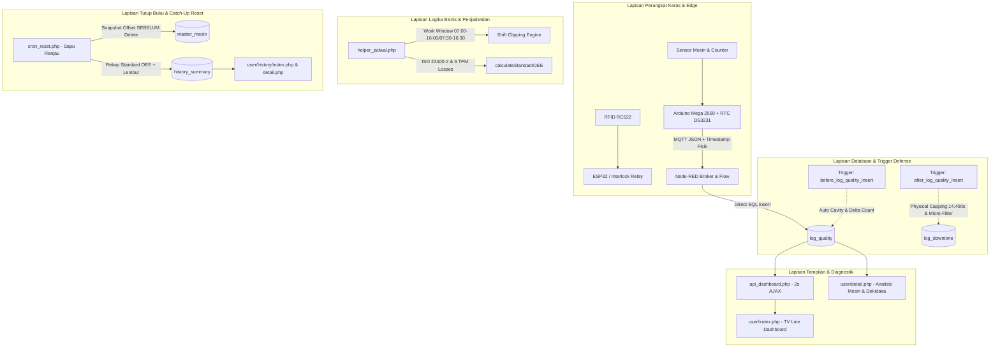

# 🏭 SMMS & OEE Dashboard System (ISO 22400-2 & TPM) — PT. CNC

Dokumentasi arsitektur sistem, panduan teknis, dan standar manufaktur internasional untuk platform **Smart Machine Monitoring System (SMMS)** dan **Overall Equipment Effectiveness (OEE)** di PT. CNC.

Sistem ini telah dimigrasikan secara penuh ke standar manufaktur internasional:
- **ISO 22400-2**: *Manufacturing operations management key performance indicators (KPIs)*.
- **TPM (Total Productive Maintenance) Six Big Losses**: Klasifikasi downtime murni tanpa bias whitelist.
- **SEMI E10**: Standar klasifikasi waktu operasional (*Operating Time vs Non-Scheduled Time*).

---

## 🗺️ 1. Peta Arsitektur Sistem Menyeluruh

Alur data berjalan secara terintegrasi dari modul sensor fisik mesin hingga dashboard pemantauan live dan rekapitulasi tutup buku:



---

## ⚙️ 2. Rincian 6 Lapisan Fungsional

### Lapisan 1: Perangkat Keras & Edge Ingestion
1. **Arduino Mega 2560 & RTC Fisik (`irfan/top3.ino`, `irfan/top8-FIX.ino`)**:
   - Membaca pulsa stroke mesin, status tombol downtime (25 tombol fisik), dan NIK operator.
   - Menggunakan tipe data `unsigned long` 32-bit untuk mencegah overflow counter (-32K).
   - Menyimpan counter ke EEPROM menggunakan algoritma **Ring Buffer Wear-Leveling 100 Slot** agar cip tidak aus.
   - Membaca waktu nyata dari modul RTC hardware dan menyertakannya ke dalam payload MQTT: `doc["timestamp"] = timestamp;`.
2. **ESP32 & Modul RFID**:
   - Berfungsi **EKSKLUSIF** untuk autentikasi operator dan interlock relay mesin (Skill Matrix Level 1–4).
   - **Aturan Tegas**: Tidak ada kartu RFID lembur. Lembur disetujui secara digital oleh Foreman/Supervisor via web.
3. **Node-RED (`irfan/flows-FIX.json`)**:
   - Berfungsi sebagai jembatan MQTT ke MySQL.
   - Node `log_quality` (`cb6629c14e852d22`) men-sanitasi format waktu fisik (`ts = d.timestamp.replace('T', ' ')`) dan mengeksekusi `INSERT INTO log_quality`.

---

### Lapisan 2: Benteng Database & Trigger MySQL
1. **Trigger `before_log_quality_insert`**:
   - Menghitung `delta_prodCount` otomatis dari selisih `prodCount` baru terhadap `raw_prodCount` sebelumnya.
   - Mengalikan output stroke dengan faktor `cavity` dari tabel `master_ct`.
   - Mengizinkan lonjakan wajar ($\Delta \le 1000$ pcs) pasca server boot/lag jaringan, dan otomatis memulihkan baseline jika Arduino reboot (counter berbalik $\le 5$).
2. **Trigger `after_log_quality_insert`**:
   - Mencatat otomatis durasi downtime saat mesin berpindah dari status non-running.
   - **Physical Capping**: Durasi di atas 4 jam (14.400 detik) otomatis diabaikan (`durasi = 0`) karena merupakan jeda mesin mati antar-shift / akhir pekan, bukan downtime aktif.
   - **Dukungan Shift 2 Lintas Tengah Malam**: Menggunakan `TIMESTAMPDIFF(SECOND, start, end)` sehingga kerusakan malam (misal 23:45 s/d 00:15) tercatat akurat 1.800 detik (30 menit) tanpa terhapus oleh pergantian tanggal.
   - **Penyaringan Durasi Mikro**: Durasi $< 30$ detik diabaikan untuk mencegah polusi data akibat operator salah tekan tombol.
   - Status `'Mesin Off'` diikutsertakan agar insiden pemadaman listrik/MCB trip pada jam kerja dihitung sah sebagai *Unplanned Downtime*.

---

### Lapisan 3: Engine Penjadwalan & Waktu Shift (`helper_jadwal.php`)
1. **Multi-Jadwal Lini Produksi (`getActiveShift`)**:
   - Mendukung multi-template (Jadwal Kerja A: 07:00–16:00, Jadwal Kerja B: 07:30–16:30, Shift 2: 19:30–04:30).
   - Menyediakan batas `work_start` dan `work_end` riil yang memproteksi jam persiapan (06:00–07:00) dari penyerapan downtime palsu.
2. **Kategorisasi TPM Six Big Losses (`classifyDowntimeCategory`)**:
   - Memetakan 25 tombol downtime fisik ke dalam 6 kategori kerugian TPM:
     * *Equipment Failure / Breakdown* (Problem Mesin, Wire Las Macet, Nozzle Tip, dll).
     * *Setup and Adjustment* (Dandory, Teaching, QC Trial, ENG Trial).
     * *Idling and Minor Stoppages* (Toilet, Minum, Sholat, Operator Izin).
     * *Reduced Speed* (Tambahan Proses, PSM, 5P/5S).
     * *Process Defects* (Problem Kualitas).
     * *Reduced Yield / Planned Pause* (Material Habis, Tunggu Material, Sarana, No Planning).
3. **Standar OEE ISO 22400-2 (`calculateStandardOEE`)**:
   - Menghitung Availability, Performance, Quality, dan OEE murni tanpa whitelist manipulatif.
   - Seluruh operasi pembagian dilindungi dari *Division by Zero*.

---

### Lapisan 4: Dashboard Realtime & Diagnostik Mesin
1. **TV Line Monitoring (`user/index.php` & `api_dashboard.php`)**:
   - Polling AJAX setiap 2 detik dengan respon JSON berkecepatan tinggi.
   - Menggunakan Single Source of Truth: `SUM(delta_prodCount)` murni dari `log_quality`.
   - Mengakumulasi downtime pemadaman berjalan (*ongoing timeout downtime*) hingga $\min(\text{time}(), \text{shift\_end\_ts})$.
2. **Diagnostik Detail Mesin (`user/detail.php`)**:
   - Grafik jam-jaman produksi (*Dekidaka*) aktual vs target.
   - Diagram Pareto Downtime terurut descending berdasarkan durasi detik riil.
   - Profil operator aktif, foto, dan badge level Skill Matrix (Level 1–4).

---

### Lapisan 5: Tutup Buku Shift & Catch-Up Reset
1. **Pekerja Latar Belakang (`cron_reset.php`)**:
   - Menerapkan **Urutan Eksekusi Anti-Macet**:
     $$\text{Ambil Counter Terakhir} \rightarrow \text{Update } offset\_raw\_produksi \rightarrow \text{Rekap History} \rightarrow \text{DELETE } log\_quality$$
   - Menjamin angka counter mesin baru langsung mulai dari 0 tanpa risiko macet membeku.
   - Kebal server mati semalaman: skrip akan melakukan *catch-up reset* otomatis saat server kembali menyala.
2. **Tabel `history_summary`**:
   - Dilengkapi kolom lembur permanen: `status_lembur`, `jam_lembur_selesai`, `durasi_lembur_menit` sehingga rekap historis lembur tetap utuh meskipun server mati semalaman.

---

### Lapisan 6: Konfigurasi & Otorisasi
- **`mesin_override`**: Pengelolaan jadwal lembur resmi (*Overtime Digital Approval*) dengan status `PENDING`, `APPROVED`, dan `REJECTED`.
- **`setting/pengaturan_jam.php`**: Manajemen master slot jam kerja dan jam istirahat.
- **`koneksi.php`**: Konfigurasi koneksi MySQL terpusat dengan penguncian zona waktu `Asia/Jakarta` (`+07:00` WIB).

---

## 🛡️ 3. Matriks Penyelesaian 7 Titik Rawan Operasional

| No | Titik Rawan Operasional | Potensi Masalah Fatal | Solusi Terpasang (Quality First) | Status |
|:--:|:-----------------------|:---------------------|:--------------------------------|:------:|
| **1** | **Blackout Server Semalam** | Server mati jam 16:00, nyala 08:30. Cron tidak jalan, counter shift baru macet. | Catch-up reset di `cron_reset.php` mengambil offset sebelum delete; persistensi status lembur di `history_summary`. | ✅ **AMAN** |
| **2** | **Mesin Mati / MCB Trip** | Mesin mati 2 jam saat jam kerja, downtime tidak tercatat karena mesin tidak kirim sinyal. | `min(time(), shift_end_ts)` mengakumulasi pemadaman berjalan sebagai *Unplanned Downtime* sah. | ✅ **AMAN** |
| **3** | **Bentrok Jadwal A vs B** | Lini A mulai 07:00, Lini B mulai 07:30. Jam 06:00–07:00 terpotong downtime palsu. | `work_start` & `work_end` riil melindungi jeda pra-shift dari potongan downtime. | ✅ **AMAN** |
| **4** | **Reset vs Shift Malam** | Shift 2 lintas tengah malam (23:45–00:15) terhapus karena perbedaan tanggal (`DATE != DATE`). | Trigger diperbarui dengan `TIMESTAMPDIFF <= 14400s`, kerusakan tengah malam Shift 2 tercatat 100% presisi. | ✅ **AMAN** |
| **5** | **Lembur Belum Disetujui** | Operator lembur tetapi Foreman belum klik ACC di web. | Status `PENDING` tetap mencatat jam reguler; saat disetujui (`APPROVED`), slot langsung terintegrasi otomatis. | ✅ **AMAN** |
| **6** | **Rekap Harian vs Live Detail** | Angka produksi di history beda dengan halaman detail karena beda formula offset. | Standarisasi mutlak ke Single Source of Truth `SUM(delta_prodCount)` di seluruh modul. | ✅ **AMAN** |
| **7** | **Double Input Data Mesin** | Data dobel dari operator manual dan pulsa sensor otomatis. | Pembagian peran tegas: Sensor otomatis untuk hitungan produksi; Operator hanya memilih kode downtime & NIK. | ✅ **AMAN** |

---

## 🚀 4. Panduan Deployment Server Perusahaan (Production Checklist)

1. **Database MySQL**:
   - Pastikan database `simulasi` sudah memuat seluruh tabel.
   - Eksekusi file [trigger.sql](file:///c:/xampp/htdocs/iot/trigger.sql) untuk memasang trigger `before_log_quality_insert` dan `after_log_quality_insert`.
   - Pastikan tabel `history_summary` memiliki kolom lembur (`status_lembur`, `jam_lembur_selesai`, `durasi_lembur_menit`).
2. **Kompatibilitas Linux Server**:
   - Seluruh query SQL di file PHP telah diaudit dan menggunakan **nama tabel huruf kecil** (`master_mesin`, `log_quality`, dll.), sehingga 100% aman pada server Linux (`lower_case_table_names = 0`).
3. **Node-RED**:
   - Import flow [irfan/flows-FIX.json](file:///c:/xampp/htdocs/iot/irfan/flows-FIX.json) ke instance Node-RED perusahaan.
   - Atur timer `Inject` node setiap 10–15 menit untuk memanggil `http://localhost/iot/cron_reset.php` sebagai pengganti Windows Task Scheduler jika ada restriksi Administrator.
4. **Verifikasi Sistem**:
   - Jalankan skrip verifikasi otomatis via terminal server:
     ```bash
     php scratch/verify_all_phases.php
     ```
   - Seluruh indikator harus berstatus `[PASS]`.
