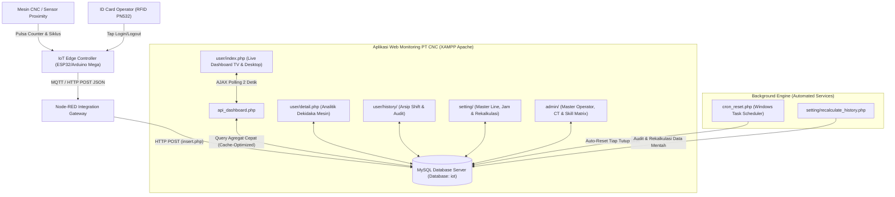

# 🏭 SISTEM IOT MES & SMART MONITORING OEE - PT CNC

Dokumentasi Komprehensif Arsitektur Sistem, Logika Bisnis, Perhitungan Standar Industri (ISO 22400-2), Detail Antarmuka (UI/UX), dan Panduan Operasional Terpadu untuk Sosialisasi Perusahaan.

---

## 📌 DAFTAR ISI
1. [Ringkasan Eksekutif untuk Manajemen](#-ringkasan-eksekutif-untuk-manajemen)
2. [Arsitektur Sistem, Hardware IoT & Alur Data](#-arsitektur-sistem-hardware-iot--alur-data)
3. [Struktur Direktori & Modul Aplikasi](#-struktur-direktori--modul-aplikasi)
4. [Standar Perhitungan OEE (ISO 22400-2)](#-standar-perhitungan-oee-iso-22400-2)
5. [Logika Rekayasa Data & Algoritma Inti (Engine Logics)](#-logika-rekayasa-data--algoritma-inti-engine-logics)
   - [A. Logika Anti-Reset & Rekonstruksi Pulsa ESP32](#a-logika-anti-reset--rekonstruksi-pulsa-esp32)
   - [B. Logika Pembatasan Fisik (Physical Capacity Capping)](#b-logika-pembatasan-fisik-physical-capacity-capping)
   - [C. Logika Deduplikasi & Pemotongan Interval Downtime (Interval Clipping)](#c-logika-deduplikasi--pemotongan-interval-downtime-interval-clipping)
   - [D. Logika Planned Production Time (PPT) Dinamis](#d-logika-planned-production-time-ppt-dinamis)
   - [E. Sinkronisasi Dua Alur Auto-Reset Shift (2-Shift Engine)](#e-sinkronisasi-dua-alur-auto-reset-shift-2-shift-engine)
   - [F. Mesin Rekalkulasi History Presisi (Zero-Discrepancy Recalculation)](#f-mesin-rekalkulasi-history-presisi-zero-discrepancy-recalculation)
   - [G. Resolusi Dual-ID Mesin & Proteksi Forensik Summary OEE](#g-resolusi-dual-id-mesin--proteksi-forensik-summary-oee)
6. [Detail Desain Antarmuka & Tata Letak Per Halaman (UI/UX)](#-detail-desain-antarmuka--tata-letak-per-halaman-uiux)
   - [A. Halaman Dashboard Utama (user/index.php)](#a-halaman-dashboard-utama-userindexphp)
   - [B. Halaman Detail Analitik Mesin (user/detail.php)](#b-halaman-detail-analitik-mesin-userdetailphp)
   - [C. Halaman Ringkasan OEE & Ekspor (user/summary_oee.php)](#c-halaman-ringkasan-oee--ekspor-usersummary_oeephp)
   - [D. Halaman Arsip History Shift (user/history/index.php & detail.php)](#d-halaman-arsip-history-shift-userhistoryindexphp--detailphp)
   - [E. Halaman Master Data & Skill Matrix (admin/)](#e-halaman-master-data--skill-matrix-admin)
   - [F. Halaman Konfigurasi Sistem & Jam Pabrik (setting/)](#f-halaman-konfigurasi-sistem--jam-pabrik-setting)
7. [Standar Navigasi Web Internasional & Resiliensi UI](#-standar-navigasi-web-internasional--resiliensi-ui)
8. [Sistem Hak Akses & Keamanan (Role-Based Access Control)](#-sistem-hak-akses--keamanan-role-based-access-control)
9. [Penanganan Kasus Khusus di Lantai Pabrik (Factory Edge Cases)](#-penanganan-kasus-khusus-di-lantai-pabrik-factory-edge-cases)
10. [Panduan Operasional, SOP & Troubleshooting](#-panduan-operasional-sop--troubleshooting)
11. [Panduan Sosialisasi ke Stakeholder Perusahaan](#-panduan-sosialisasi-ke-stakeholder-perusahaan)

---

## 🌟 RINGKASAN EKSEKUTIF UNTUK MANAJEMEN

Sistem **Smart Manufacturing Execution System (MES) & OEE Realtime** PT CNC dirancang untuk menjembatani lantai produksi (*shop floor*) dengan manajemen secara otomatis, transparan, dan akurat. Sistem ini menghubungkan 300+ mesin produksi menggunakan mikrokontroler IoT (*Arduino Mega / ESP32*) dengan dashboard analitik berbasis web terpusat.

### Nilai Strategis & Keunggulan bagi Perusahaan:
* **Transparansi Tanpa Jeda (Realtime Shop Floor Visibility):** Manajemen dan supervisor dapat memantau status operasional mesin (RUNNING, STANDBY, ALARM, OFF) dan pencapaian OEE per detik tanpa menunggu laporan manual kertas.
* **Standar Mutu Dunia (ISO 22400-2 Compliant):** Parameter OEE dihitung mengacu pada standar manufaktur internasional (Availability, Performance, Quality) yang diakui global.
* **Resiliensi Tinggi & Anti-Data Loss:** Dirancang khusus tahan terhadap fluktuasi listrik pabrik, restart hardware ESP32, dan putus koneksi jaringan.
* **Otomasi Shift Penuh (Unattended Automation):** Pergantian shift kerja (Shift 1 & Shift 2) dan pengarsipan data historis berjalan otomatis 24/7 di latar belakang tanpa membutuhkan campur tangan manusia.
* **Audit Trail Terpercaya (Zero Discrepancy):** Dilengkapi modul rekalkulasi forensik yang mampu merekonstruksi ulang data riwayat dari log mentah (*raw sensor pulses*) jika terjadi penyesuaian cycle time atau jam kerja.

---

## 🔄 ARSITEKTUR SISTEM, HARDWARE IOT & ALUR DATA



### Spesifikasi Protokol Data Telemetri (`insert.php`):
Node-RED meneruskan telemetri dari mikrokontroler ke server melalui HTTP POST dengan format payload standar:
```json
{
  "mc_id": "MC-001",
  "line": "LINE-01",
  "prodCount": 1420,
  "cycleTime": 24.5,
  "status": "RUNNING",
  "downtime_code": "DT00",
  "operator_nik": "10452"
}
```
* **Status Mesin:**
  - `RUNNING` (Mesin berputar memotong benda kerja).
  - `STANDBY` (Mesin menyala namun menunggu material atau operator).
  - `ALARM` (Mesin mengalami kendala mekanik/listrik/program).
  - `OFF` (Mesin mati di luar jam kerja atau hari libur).

---

## 📁 STRUKTUR DIREKTORI & MODUL APLIKASI

Codebase terstruktur rapi, modular, dan bersih dari berkas sementara atau duplikat:

```
c:/xampp/htdocs/iot/
├── index.php                      # Pintu gerbang utama (Auto-redirect ke user/index.php)
├── login.php                      # Autentikasi sistem (Clean UI dengan Smart Back)
├── logout.php                     # Pembersihan sesi login terpadu
├── auth_check.php                 # Middleware penjaga RBAC per halaman
├── koneksi.php                    # Koneksi database MySQL & pemaksaan Timezone WIB (+07:00)
├── api_dashboard.php              # High-speed JSON API melayani live dashboard
├── insert.php                     # HTTP endpoint penerima telemetri IoT dari Node-RED
├── cron_reset.php                 # Engine background otomasi tutup shift & arsip
├── proses_reset.php               # Handler pemicu reset manual (Testing / Emergency)
├── helper_jadwal.php              # Engine kalkulasi PPT, jam lembur, & physical capacity cap
├── helper_downtime.php            # Engine pemotongan interval downtime & shift detector
├── setup_server.php               # Utilitas 1-Click instalasi database & struktur tabel
├── setup_cron.bat                 # Batch script instalasi Windows Task Scheduler
│
├── admin/                         # Modul Administrasi Master Data (Admin & IT)
│   ├── data_operator.php          # Manajemen operator, NIK, UID RFID, & foto profil
│   ├── master_ct.php              # Manajemen Master Cycle Time, Kode Proses, & Target/Jam
│   └── skill_matrix.php           # Matriks kompetensi operator per mesin (Level 1-4)
│
├── setting/                       # Modul Konfigurasi Sistem (Khusus Tim IT / Setting)
│   ├── pengaturan_jam.php         # Master template jadwal kerja pabrik & istirahat
│   ├── pengaturan_jam_detail.php  # Editor rincian slot jam kerja per shift & kategori hari
│   ├── pengaturan_line.php        # Konfigurasi line pabrik & jam auto-reset 2 shift
│   ├── recalculate_history.php    # Mesin audit & rekalkulasi history dari raw logs
│   └── settings_auth.php          # Konfigurasi akun login & toggle kewajiban auth
│
├── user/                          # Modul Operasional & Monitoring (Semua Pengguna)
│   ├── index.php                  # Dashboard utama monitoring OEE live seluruh mesin
│   ├── detail.php                 # Detail analitik dekidaka per jam, operator, & downtime
│   ├── summary_oee.php            # Rangkuman tabel OEE pabrik & ekspor laporan Excel
│   └── history/                   # Sub-modul Arsip Produksi
│       ├── index.php              # Katalog data history shift dengan filter tanggal/line
│       └── detail.php             # Rincian dekidaka & audit performa shift masa lalu
│
├── assets/                        # Direktori Aset Statis
│   └── foto_operator/             # Direktori penyimpanan foto profil resmi operator
│
├── irfan/                         # Direktori Firmware IoT (Firmware resmi mikrokontroler)
│   ├── *.ino                      # Source code Arduino Mega & ESP32
│   └── *.json                     # Skema Node-RED & konfigurasi MQTT
│
└── agents/                        # Dokumentasi & Standar Pabrik
    └── skills/iot-factory-standards/
        ├── README.md              # Buku panduan sosialisasi sistem (Dokumen resmi ini)
        ├── SKILL.md               # Spesifikasi kapabilitas & protokol agen otomatis
        └── update_perkembangan.txt# Log catatan kronologis pembaruan sistem (Max 75 char/line)
```

---

## 📊 STANDAR PERHITUNGAN OEE (ISO 22400-2)

Sistem mengadopsi standar internasional **ISO 22400-2** untuk menjamin validitas metrik manufaktur:

$$\text{OEE} = \text{Availability (A)} \times \text{Performance (P)} \times \text{Quality (Q)}$$

```
+-----------------------------------------------------------------------------------+
|                        TOTAL WAKTU KERJA SHIFT (Total Shift Time)                 |
+-------------------------------------------------+---------------------------------+
|        PLANNED PRODUCTION TIME (PPT)            |   Planned Downtime (Istirahat)  |
+--------------------------------+----------------+---------------------------------+
|    OPERATING TIME (Run Time)   | Unplanned DT   |                                 |
+--------------------------------+----------------+                                 |
| Net Operating Time | Speed Loss|                                                  |
+--------------------+-----------+                                                  |
| Value Time | Scrap |                                                              |
+------------+-------+                                                              |
```

### 1. Ketersediaan Mesin (Availability - A)
Mengukur persentase waktu mesin beroperasi produktif dibandingkan waktu yang direncanakan:

$$\text{Planned Production Time (PPT)} = \text{Total Waktu Shift} - \text{Total Istirahat Terencana}$$

$$\text{Operating Time (OT)} = \text{PPT} - \text{Total Unplanned Downtime}$$

$$\text{Availability (A)} = \frac{\text{Operating Time}}{\text{PPT}} \times 100\%$$

* **Planned Downtime (Tidak Mengurangi Availability):** Istirahat makan, istirahat sholat Jumat, briefing 5S, pemeliharaan preventif terjadwal.
* **Unplanned Downtime (Mengurangi Availability):** Kerusakan mesin (*breakdown*), ganti tool patah, material kosong, menunggu instruksi kerja.

### 2. Kinerja Operasi (Performance - P)
Mengukur efisiensi kecepatan proses mesin dibandingkan kecepatan idealnya (*Ideal Cycle Time*):

$$\text{Target Output per Jam} = \frac{3600}{\text{Cycle Time (detik)}}$$

$$\text{Net Operating Time} = \text{Total Output (OK + NG)} \times \text{Ideal Cycle Time (detik)}$$

$$\text{Performance (P)} = \frac{\text{Net Operating Time}}{\text{Operating Time}} \times 100\%$$

* Catatan: Jika operator bekerja lebih cepat daripada standar CT tanpa menghasilkan cacat, angka Performance dapat mencapai di atas 100% secara proporsional.

### 3. Kualitas Produk (Quality - Q)
Mengukur rasio produk jadi berkualitas baik (*Good Parts*) terhadap total seluruh produk:

$$\text{Total Output} = \text{Produk OK} + \text{Produk NG (Reject/Scrap)}$$

$$\text{Quality (Q)} = \frac{\text{Produk OK}}{\text{Total Output}} \times 100\%$$

---

## ⚙️ LOGIKA REKAYASA DATA & ALGORITMA INTI (ENGINE LOGICS)

### A. Logika Anti-Reset & Rekonstruksi Pulsa ESP32
* **Tantangan Lapangan:** Mikrokontroler di pabrik dapat mengalami restart mendadak (akibat drop voltase sesaat, lonjakan mesin las, atau auto-reboot). Saat ESP32 reboot, variabel counter `prodCount` kembali bernilai 0.
* **Algoritma Rekayasa (Delta Tracking):**
  - Jika $\text{counter\_baru} \ge \text{counter\_lama}$, maka penambahan pulsa adalah:
    $$\Delta = \text{counter\_baru} - \text{counter\_lama}$$
  - Jika $\text{counter\_baru} < \text{counter\_lama}$, sistem mendeteksi terjadinya *hardware reset*. Pulsa baru tidak dibuang, melainkan dihitung:
    $$\Delta = \text{counter\_baru}$$
  - Akumulasi total output shift tetap utuh sempurna tanpa kehilangan data sebutir pun.

### B. Logika Pembatasan Fisik (Physical Capacity Capping)
* **Tantangan Lapangan:** *Noise* frekuensi tinggi pada sensor proximity atau tumpukan paket data saat jaringan WiFi tersambung kembali (*reconnection burst*) dapat mengirimkan lonjakan angka palsu (misal bertambah 500 pcs dalam 1 detik).
* **Algoritma Rekayasa:** Sistem membatasi penambahan pulsa per jam berdasarkan batasan kapasitas fisik mesin (*Physical Hourly Capacity*):
  
  $$\text{Kapasitas Maksimal Fisik} = \left( \frac{3600}{\text{Cycle Time}} \right) \times 1.25$$

  - Penambahan counter yang melampaui 125% kapasitas fisik secara otomatis dipotong (*clipping*) dan baseline disinkronkan kembali untuk mencegah angka *ghost production*.

### C. Logika Deduplikasi & Pemotongan Interval Downtime (Interval Clipping)
* **Tantangan Lapangan:** Operator kerap menekan tombol downtime berulang kali atau mengganti kategori kendala di tengah proses perbaikan, menghasilkan rekaman interval yang saling bertumpukan (*overlapping*).
* **Algoritma Rekayasa (Interval Merging Algorithm):**
  1. Seluruh rekaman downtime pada shift diurutkan berdasarkan `timestamp_mulai`.
  2. Interval yang saling bertumpuk digabungkan menjadi satu rentang tunggal $[A_{\text{start}}, \max(A_{\text{end}}, B_{\text{end}})]$.
  3. Total durasi losstime dihitung dari akumulasi rentang gabungan murni, menjamin tidak ada dobel hitung waktu losstime.
  4. Untuk downtime yang masih berjalan (*ongoing*) saat pergantian shift, durasi secara presisi dipotong (*clipped*) tepat pada jam batas shift aktif, dan durasi sisanya dilanjutkan ke shift berikutnya.

### D. Logika Planned Production Time (PPT) Dinamis
* Perhitungan jam kerja efektif tidak bersifat statis, melainkan dievaluasi dinamis dari tabel `master_template_jam` dan `master_jam_statis` berdasarkan:
  - **Hari Kerja:** Otomatis mengenali perbedaan jadwal kerja reguler (Senin–Kamis), jadwal khusus hari Jumat (pemotongan durasi istirahat Sholat Jumat yang lebih panjang), dan jadwal lembur akhir pekan (Sabtu–Minggu).
  - **Mapping Line:** Tiap line produksi dapat menggunakan template jam kerja yang berbeda sesuai kebutuhan departemennya.

### E. Sinkronisasi Dua Alur Auto-Reset Shift (2-Shift Engine)
Sistem memfasilitasi 2 shift kerja berkesinambungan:
* **Shift 1 (Pagi - Sore):** Jam reset standar pukul `18:00:00 WIB`.
* **Shift 2 (Malam - Pagi):** Jam reset standar pukul `06:30:00 WIB` (lintas hari / *cross-midnight*).

#### Keamanan Eksekusi (Dual-Trigger Resilience):
1. **Pemicu Otomatis (`cron_reset.php`):** Dijalankan berkala oleh Windows Task Scheduler.
2. **Pemicu Manual (`proses_reset.php`):** Tombol khusus di dashboard bagi tim IT/Admin untuk pengujian atau perantian darurat.
3. **Pencegahan Double-Reset:** Kedua skrip menggunakan mekanisme sinkronisasi atomic:
   - Kolom `waktu_reset` dan flag penanda tanggal dicatat di database.
   - Pengecekan interval batas minimal mencegah reset tereksekusi dua kali pada jendela menit yang sama.
   - Menggunakan transaksi SQL (`START TRANSACTION` ... `COMMIT`) sehingga jika terjadi kegagalan jaringan di tengah proses arsip, data akan di-*rollback* aman tanpa merusak log produksi.
4. **Resiliensi Server Mati:** Jika PC server mati berjam-jam atau berhari-hari saat libur panjang, saat server kembali menyala, engine akan mendeteksi jeda waktu (*unprocessed shift backlog*) dan mengarsipkan data lampau ke tanggal yang tepat tanpa menimpa data hari berjalan.

### F. Mesin Rekalkulasi History Presisi (Zero-Discrepancy Recalculation)
Melalui menu `setting/recalculate_history.php`, tim IT memiliki alat audit forensik:
* Jika terjadi perubahan pada Master Cycle Time atau perbaikan template jam kerja di kemudian hari, tim IT dapat memicu rekalkulasi ulang data historis.
* Mesin akan membaca ulang seluruh *raw logs* (`history_quality` dan `history_downtime`), menyusun ulang dekidaka, dan memperbarui tabel agregat `history_summary` dengan akurasi 100%.

### G. Resolusi Dual-ID Mesin & Proteksi Forensik Summary OEE
Menjawab tantangan heterogenitas perangkat di lantai pabrik di mana satu mesin memiliki ID numerik database (`mcID`, misal `3196`) dan kode fisik string (`id_mesin`, misal `'2 WS35 - 020'`), sistem menerapkan mesin resolusi identitas terpadu:
1. **Penyelesaian Otomatis Multi-Format (Dual-ID Resolution):**
   - Setiap kali halaman riwayat dibuka, sistem membaca relasi di `master_mesin` dan membentuk ekspresi pencarian ganda: `IN ('3196', '2 WS35 - 020')`.
   - Hal ini memastikan kueri riwayat (`history_quality`, `history_downtime`, `history_ng`, dan `skill_matrix`) selalu berhasil memetakan ratusan ribu log mentah sensor tanpa terputus.
2. **Harmonisasi Jam Shift Dinamis (`setting_pabrik`):**
   - Batas jam Shift 1 dan Shift 2 tidak lagi dikunci secara statis, melainkan ditarik langsung dari tabel `setting_pabrik` (`18:00:00` dan `06:30:00`), mencegah pemotongan data produksi sore hari.
3. **Pencarian Mundur Otomatis (*Fallback*) ke `master_ct`:**
   - Jika log mentah tidak merekam cycle time, sistem secara cerdas menelusuri data part pada `master_ct` berdasarkan `part_name` untuk merekonstruksi standar cycle time detik dan target per jam.
4. **Proteksi Forensik Nilai OEE (*Summary Preservation*):**
   - Mencegah fenomena rekalkulasi 0% menimpa data yang sah. Jika kalkulasi dinamis menghasilkan $0\%$ padahal `history_summary` telah menyimpan capaian OEE yang valid, sistem mengunci nilai summary tersebut sebagai kebenaran tunggal (*single source of truth*).
5. **Sintesis Baris Dekidaka Cadangan:**
   - Memastikan tabel dekidaka per jam tidak pernah menampilkan *"NO DATA"* saat total produksi tercatat ribuan pcs di rekapitulasi shift.

---

## 🎨 DETAIL DESAIN ANTARMUKA & TATA LETAK PER HALAMAN (UI/UX)

Seluruh halaman web dirancang dengan filosofi **Modern Industrial Dark Mode** yang memprioritaskan keterbacaan tinggi (*high-contrast readability*), kenyamanan mata operator saat pemantauan 24 jam di TV monitor pabrik, serta interaksi responsif tanpa kedipan (*flicker-free polling*).

### A. Halaman Dashboard Utama (`user/index.php`)
* **Tujuan:** Pusat komando monitoring realtime seluruh mesin pabrik bagi operator, line leader, dan manajemen.
* **Komponen & Tata Letak:**
  1. **Header Bar Global:**
     - Menampilkan Logo PT CNC, Jam Digital WIB Realtime (`HH:mm:ss`), Tanggal Aktif, Indikator Shift Berjalan, dan Badge Koneksi WebSocket/API (Hijau: Terhubung).
     - Tombol Navigasi Cepat: Filter Line Dropdown, Tombol `Summary OEE`, Tombol `History`, dan Burger Menu `☰`.
     - *Admin Only:* Tombol darurat `🛠️ FORCE RESET SHIFT (TESTING)`.
  2. **Kartu Ringkasan Pabrik (Factory KPI Cards):**
     - 4 Kartu Metrik Utama di bagian atas: Total Mesin Terhubung, Rata-Rata OEE Pabrik (%), Total Output OK (Pcs), dan Total Downtime (Menit).
  3. **Grid Kartu Mesin (Machine Visual Cards):**
     - Setiap mesin direpresentasikan oleh kartu visual dengan indikator warna status bercahaya (*glow effect*):
       * 🟢 **RUNNING (Hijau #10b981):** Mesin beroperasi normal.
       * 🟡 **STANDBY (Kuning #f59e0b):** Mesin hidup menunggu operator/material.
       * 🔴 **ALARM / DOWNTIME (Merah #ef4444):** Mesin mengalami kendala (menampilkan kode downtime aktif).
       * ⚪ **OFF (Abu-abu #64748b):** Mesin mati.
     - Informasi pada kartu: Nama Mesin, Nama Operator (dengan foto profil kecil), Part Number yang sedang berjalan, Target Output vs Aktual, dan Nilai OEE saat ini.
     - Mengklik kartu mesin akan mengarahkan pengguna secara mulus ke halaman **Detail Analitik Mesin**.
  4. **Pembaruan Data Tanpa Kedip (Flicker-Free AJAX Polling):**
     - Data diperbarui otomatis setiap 2 detik via `api_dashboard.php` menggunakan DOM patching terarah, sehingga layar TV monitor tidak melakukan refresh halaman penuh (*no full-page reload*).

### B. Halaman Detail Analitik Mesin (`user/detail.php`)
* **Tujuan:** Analisis mendalam kinerja satu mesin spesifik pada shift berjalan.
* **Komponen & Tata Letak:**
  1. **Smart Back Header:** Tombol kembali cerdas dengan teks dinamis dan ikon panah halus `← Kembali`.
  2. **Profil Operator & Status Mesin:**
     - Foto resmi operator resolusi tinggi, NIK, Nama Lengkap, dan Badge Tingkat Keahlian (*Skill Level 1–4*).
     - Informasi Part Number aktif, Standar Cycle Time (detik/pcs), dan Target Output per jam.
  3. **Trio Gauge Meter OEE (Speedometer Visual):**
     - Tiga instrumen setengah lingkaran interaktif: **Availability (%)**, **Performance (%)**, dan **Quality (%)**, serta kalkulasi akhir **OEE Total (%)**.
     - Zona warna gauge: Merah ($< 75\%$), Kuning ($75\% - 84\%$), Hijau ($\ge 85\%$).
  4. **Tabel Dekidaka Per Jam (Hourly Production Tracking):**
     - Memecah performa shift ke dalam slot per jam (misal 07:00-08:00, 08:00-09:00, dst.).
     - Kolom tabel: Jam Ke-, Target Output, Aktual OK, Aktual NG, Defect Rate (%), Durasi Running (menit), Durasi Downtime (menit), dan Status Efisiensi.
  5. **Daftar Rincian Downtime (Log Losstime):**
     - Tabel kronologis setiap insiden kendala: Jam Mulai, Jam Selesai, Total Durasi, Kategori Kendala, dan Catatan Teknisi.

### C. Halaman Ringkasan OEE & Ekspor (`user/summary_oee.php`)
* **Tujuan:** Laporan tabular komprehensif performa seluruh mesin dalam satu layar untuk rapat harian produksi (*Daily Production Meeting*).
* **Komponen & Tata Letak:**
  1. Filter Tanggal, Shift (Shift 1 / Shift 2 / Semua), dan Line Produksi.
  2. Tabel Matriks OEE Lengkap: Line, No. Mesin, Part Name, Target, Total Output, Good, Defect, Availability, Performance, Quality, dan OEE.
  3. Indikator Kondisional: Baris tabel otomatis memiliki penanda warna sesuai standar World Class OEE ($> 85\%$ = Unggul, $< 65\%$ = Perlu Tindakan Korektif).
  4. Tombol **Ekspor Excel (.xlsx / .csv)** untuk kebutuhan dokumentasi manajemen mutu dan audit manufaktur.

### D. Halaman Arsip History Shift (`user/history/index.php` & `detail.php`)
* **Tujuan:** Penelusuran arsip kinerja shift masa lalu untuk investigasi kendala, audit mutu, dan evaluasi tren produksi harian.
* **Komponen & Arsitektur `user/history/index.php`:**
  1. **Filter Bar Interaktif Terpadu:**
     - Date picker kalender yang otomatis mengunci batas tanggal minimum dan maksimum sesuai data nyata di database.
     - Dropdown filter Shift (Shift 1, Shift 2, Rekap Harian) dan Dropdown Mesin.
  2. **Grid Kartu Riwayat Mesin (History Machine Cards):**
     - Setiap kartu menampilkan Badge Tanggal, Badge Shift, Nama Mesin resmi, ID Mesin fisik, serta Part Name terakhir yang diproduksi.
     - Output counter (OK Pcs vs NG Pcs) dan penanda warna OEE: Hijau ($\ge 85\%$), Kuning ($75\% - 84\%$), dan Merah ($< 75\%$).
  3. **Mesin Penyelaras Dual ID:**
     - Relasi kueri menggunakan `LEFT JOIN master_mesin mm ON (hs.mcID = mm.mcID OR hs.mcID = mm.id_mesin)` sehingga kartu tetap valid terlepas dari apakah summary tersimpan dalam ID numerik atau string.
* **Komponen & Arsitektur `user/history/detail.php`:**
  1. **Header Navigasi & Status Arsip:**
     - Tombol kembali cerdas `← Kembali ke History`, judul arsip memuat Nama Mesin resmi dan Kode ID Mesin, badge status arsip, dan jam digital WIB realtime.
  2. **Panel Detail Mesin & Shift:**
     - Menampilkan Nama Mesin, Machine ID (`string_mcID`), Line Produksi, Shift Aktif, Tanggal Produksi, dan Nilai OEE.
  3. **Profil Operator & Riwayat Jam Kerja Operator:**
     - Foto resmi operator, Nama Lengkap, NIK, dan Badge Skill Matrix (Level 1–4).
     - Daftar kronologis pergantian operator pada shift tersebut: rentang jam kerja operator dan akumulasi output yang dihasilkan tiap operator.
  4. **Panel Standar Proses & Part:**
     - Part Name, Part Number, Nama Proses, Standar Cycle Time (detik), dan Target per jam.
     - Dilengkapi mekanisme pencarian mundur otomatis (*auto-recovery fallback*) ke `master_ct` jika log mentah belum memuat nilai CT.
  5. **Summary Defect & Metrik OEE ISO 22400-2:**
     - Tabel rincian jenis defect, Qty NG, Qty Repair, dan Net Scrap.
     - 4 Kartu Ringkasan Produksi: Total OK, Total NG, Total Repair, Total Scrap.
     - 4 Kartu KPI ISO 22400-2: Availability (%), Performance (%), Quality (%), dan OEE Standar (%).
     - Dilengkapi **Summary Preservation Engine** yang mencegah nilai OEE valid tertimpa menjadi 0% saat rekalkulasi log mentah.
  6. **Visualisasi Pareto Downtime & Dekidaka Bar Chart:**
     - **Donut Pareto Downtime:** Menampilkan porsi tiap kategori kendala dengan angka Total Losstime (Menit) di pusat lingkaran donut.
     - **Dekidaka Bar Chart:** Grafik batang komparasi Actual vs Target per slot jam shift.
  7. **Tabel Rincian Arsip Produksi Per Jam (Interactive DataTables):**
     - Memuat kolom Part Name, Part Number, Proses (CT), kolom per slot jam aktif (misal 06:00-07:00, dst.), dan Total per baris.
     - Baris Footer Total Akumulasi per jam dan Grand Total shift.
     - **Failsafe Anti-Blank:** Jika log per jam kosong namun summary mencatat output nyata, sistem secara otomatis menyintesis baris produksi sehingga tabel tidak pernah menampilkan pesan *"NO DATA"*.

### E. Halaman Master Data & Skill Matrix (`admin/`)
* **Tujuan:** Pengelolaan data induk operasional oleh staf Admin dan Supervisor.
* **Komponen & Tata Letak:**
  1. **Data Operator (`admin/data_operator.php`):** Form modal tambah/edit operator, input NIK, Nama, Bagian, UID RFID (bisa ditap langsung dari reader USB), dan pengunggah foto profil resmi dengan pemotong gambar (*image preview*).
  2. **Master Cycle Time (`admin/master_ct.php`):** Tabel daftar part, kode proses, standar cycle time detik, dan kalkulasi otomatis target output per jam.
  3. **Skill Matrix Mesin (`admin/skill_matrix.php`):** Matriks interaktif pemetaan operator terhadap 300+ mesin:
     - Level 1 (Trainee / Belum Boleh Mandiri).
     - Level 2 (Junior / Operasi Didampingi).
     - Level 3 (Operator Mandiri / Terverifikasi Mesin Kritis).
     - Level 4 (Expert / Trainer).
     - Sistem interlock RFID membaca matriks ini untuk menentukan izin pengoperasian mesin.

### F. Halaman Konfigurasi Sistem & Jam Pabrik (`setting/`)
* **Tujuan:** Pengaturan parameter global dan pemeliharaan sistem oleh Administrator IT.
* **Komponen & Tata Letak:**
  1. **Pengaturan Jam Kerja (`setting/pengaturan_jam.php` & `detail.php`):** Editor fleksibel slot waktu kerja, jam mulai/akhir shift, dan jadwal istirahat per hari (Reguler vs Jumat).
  2. **Pengaturan Line & Jam Reset (`setting/pengaturan_line.php`):** Konfigurasi line pabrik dan penentuan jam batas auto-reset Shift 1 (`18:00:00`) dan Shift 2 (`06:30:00`).
  3. **Mesin Rekalkulasi History (`setting/recalculate_history.php`):** Alat audit forensik dengan tampilan perbandingan data sebelum vs sesudah rekalkulasi sebelum tombol eksekusi permanen ditekan.
  4. **Keamanan & Autentikasi (`setting/settings_auth.php`):** Manajemen akun pengguna (Username, Role, Reset Password) dan saklar toggle kewajiban login dashboard TV.

---

## 🌐 STANDAR NAVIGASI WEB INTERNASIONAL & RESILIENSI UI

Sistem mengadopsi standar rekayasa antarmuka web modern untuk menjamin kenyamanan pengguna (*user delight*) dan meniadakan kendala navigasi:

1. **Smart Back Navigation (Bebas Tautan Buntu / No Dead Link):**
   - Menggunakan script validasi riwayat peramban dengan pengecekan domain asal (*Same-Origin Referrer Check*):
     ```javascript
     onclick="if(history.length > 1 && document.referrer.indexOf(window.location.host) !== -1){ history.back(); return false; }"
     ```
   - **Mekanisme Fallback Terarah:** Jika pengguna membuka halaman melalui bookmark, tautan WhatsApp, atau tab baru peramban (di mana `history.length <= 1`), tombol kembali tidak macet, melainkan otomatis mengarahkan pengguna kembali ke URL induk yang valid (Dashboard Utama).
2. **Mikro-Animasi Halus (Smooth Hover Transitions):**
   - Transisi visual tombol menggunakan kurva standar CSS `cubic-bezier(0.4, 0, 0.2, 1)`.
   - Tombol kembali memberikan umpan balik taktil mikro berupa pergeseran halus `translateX(-2px)` dan pencerahan kontras saat disentuh kursor mouse (*hover state*).
3. **Harmonisasi Sidebar Drawer di Seluruh Halaman:**
   - Tombol menu burger `☰` terpasang konsisten di pojok kiri atas seluruh halaman aplikasi.
   - Menu drawer muncul mulus dari sisi kiri (*smooth sliding drawer*) dengan penanda aktif (*active link highlight*) sesuai halaman yang sedang dibuka.
   - Pintu keluar (`🚪 Logout`) diberi warna merah khusus untuk mencegah salah klik.
4. **Resiliensi Tampilan Layar TV (High Contrast Industrial Theme):**
   - Kontras warna teks dan latar belakang memenuhi standar **WCAG 2.1 Level AAA** untuk memastikan angka OEE terbaca jelas dari jarak 10 meter di lantai pabrik.

---

## 🔒 SISTEM HAK AKSES & KEAMANAN (ROLE-BASED ACCESS CONTROL)

Sistem menerapkan pengamanan berlapis berbasis peran (*Role-Based Access Control - RBAC*) yang dikontrol secara ketat melalui `auth_check.php`:

| Modul & Halaman Web | Role IT / Setting | Role Admin | Role User (Operator / TV) |
| :--- | :---: | :---: | :---: |
| **Dashboard Monitoring Live (`user/index.php`)** | ✅ Buka & Pantau | ✅ Buka & Pantau | ✅ Buka & Pantau |
| **Detail Analitik Mesin (`user/detail.php`)** | ✅ Akses Penuh | ✅ Akses Penuh | ✅ Akses Penuh |
| **Katalog & Detail History (`user/history/`)** | ✅ Akses Penuh | ✅ Akses Penuh | ✅ Akses Penuh |
| **Rangkuman OEE & Ekspor (`user/summary_oee.php`)**| ✅ Akses Penuh | ✅ Akses Penuh | ✅ Akses Penuh |
| **Master Data Operator (`admin/data_operator.php`)**| ✅ Kelola & Edit | ✅ Kelola & Edit | ❌ Akses Ditolak (403) |
| **Master Cycle Time (`admin/master_ct.php`)** | ✅ Kelola & Edit | ✅ Kelola & Edit | ❌ Akses Ditolak (403) |
| **Master Skill Matrix (`admin/skill_matrix.php`)** | ✅ Kelola & Edit | ✅ Kelola & Edit | ❌ Akses Ditolak (403) |
| **Template Jam Kerja (`setting/pengaturan_jam.php`)**| ✅ Konfigurasi Penuh | ❌ Akses Ditolak (403) | ❌ Akses Ditolak (403) |
| **Pengaturan Line & Reset (`setting/pengaturan_line.php`)**| ✅ Konfigurasi Penuh | ❌ Akses Ditolak (403) | ❌ Akses Ditolak (403) |
| **Rekalkulasi History (`setting/recalculate_history.php`)**| ✅ Eksekusi Khusus | ❌ Akses Ditolak (403) | ❌ Akses Ditolak (403) |
| **Manajemen Akun Login (`setting/settings_auth.php`)**| ✅ Kelola Pengguna | ❌ Akses Ditolak (403) | ❌ Akses Ditolak (403) |

### Fitur Keamanan Sistem:
* **Saklar Fleksibilitas Autentikasi (Auth Toggle):** Diatur melalui `setting/settings_auth.php`. Jika diaktifkan (*Public Mode*), layar TV monitor pabrik dapat langsung menampilkan dashboard tanpa harus login. Namun, seluruh halaman pengaturan sensitif (Admin & Setting) **wajib tetap melalui proses login**.
* **Proteksi Password Standar Industri:** Seluruh kata sandi dienkripsi menggunakan algoritma `BCRYPT` salted hash yang aman dari serangan brute-force.
* **Pembersihan Sesi Aman:** Tombol logout menghancurkan seluruh variabel sesi peramban dan mengembalikan pengguna ke halaman login dengan notifikasi sukses.

---

## 🛡️ PENANGANAN KASUS KHUSUS DI LANTAI PABRIK (FACTORY EDGE CASES)

| Kasus Khusus Lapangan | Risiko Jika Tidak Ditangani | Solusi Rekayasa Sistem PT CNC |
| :--- | :--- | :--- |
| **Listrik Pabrik Drop / ESP32 Restart** | Counter produksi kembali ke 0, hasil kerja operator hilang. | **Algoritma Delta Tracking:** Sistem mendeteksi restart hardware dan terus mengakumulasikan pulsa baru ke total shift tanpa jeda. |
| **Noise Listrik / Lonjakan Sensor Palsu** | Angka produksi melonjak ribuan pcs (*ghost production*). | **Physical Capacity Cap:** Penambahan pulsa dibatasi maksimal 125% kapasitas fisik mesin per jam. Lonjakan palsu otomatis dipotong (*clipping*). |
| **Operator Dobel Tekan Tombol Downtime** | Total jam rusak membengkak melampaui jam shift (*overlapping*). | **Interval Merging Algorithm:** Interval downtime yang saling bertumpukan disatukan menjadi satu rentang waktu tunggal. |
| **Downtime Masih Berjalan Saat Tutup Shift** | Durasi downtime terpotong hilang atau terbawa salah ke shift baru. | **Downtime Shift Clipping:** Jam akhir downtime aktif dipotong presisi di jam tutup shift, dan sisanya dilanjutkan otomatis ke shift baru. |
| **PC Server Mati / Libur Panjang** | Auto-reset terlewat, data shift bercampur aduk. | **Catch-Up Engine:** Saat server kembali menyala, skrip mendeteksi backlog shift yang terlewat dan mengarsipkannya rapi ke tanggal yang sesuai. |
| **Shift 2 Lintas Hari (Cross-Midnight)** | Perhitungan jam kerja salah karena tanggal berganti tengah malam. | **Cross-Midnight Boundary Handler:** Sistem mengenali rentang 18:00 hingga 06:30 hari berikutnya sebagai satu kesatuan shift kerja utuh. |
| **Perbedaan Jadwal Hari Jumat** | Availability salah karena waktu Sholat Jumat dihitung mesin menganggur. | **Dynamic PPT Template:** Sistem otomatis memotong durasi istirahat Sholat Jumat dari PPT sehingga tidak mengurangi nilai Availability. |

---

## 📖 PANDUAN OPERASIONAL, SOP & TROUBLESHOOTING

### 1. Prosedur Rutin Operator Lantai Produksi (SOP Operator)
1. **Awal Shift:** Dekati mesin, tempelkan kartu identitas RFID pada sensor reader di boks kontroler IoT.
2. **Verifikasi Layar:** Pastikan indikator lampu mesin menyala hijau dan nama operator muncul pada dashboard web mesin yang bersangkutan.
3. **Saat Terjadi Kendala (Downtime):** Jika mesin berhenti karena kendala mekanik, ganti pisau, atau material habis, tekan tombol kode kendala yang sesuai pada boks IoT.
4. **Setelah Kendala Selesai:** Tekan tombol resume/selesai pada boks IoT. Mesin kembali ke status RUNNING dan counter produksi kembali aktif.
5. **Akhir Shift:** Lakukan tap out kartu RFID. Sistem akan menutup sesi operator secara otomatis.

### 2. Prosedur Pengawas & Tim IT (SOP Pemeliharaan)
1. **Pendaftaran Operator Baru:** Buka menu `admin/data_operator.php` $\rightarrow$ Klik `+ Tambah Operator` $\rightarrow$ Masukkan NIK, Nama, Bagian, UID RFID, dan unggah foto profil resmi.
2. **Pengkinian Skill Matrix:** Buka menu `admin/skill_matrix.php` $\rightarrow$ Tentukan level kompetensi operator (Level 1–4) pada mesin yang diizinkan.
3. **Pendaftaran Produk / Cycle Time Baru:** Buka menu `admin/master_ct.php` $\rightarrow$ Daftarkan Part Name, Part Number, Cycle Time standar, dan Target Output per Jam.
4. **Verifikasi Jadwal Auto-Reset:** Buka menu `setting/pengaturan_line.php` $\rightarrow$ Pastikan jam reset Shift 1 (`18:00:00`) dan Shift 2 (`06:30:00`) sesuai jadwal kerja perusahaan terkini.
5. **Audit Forensik Data:** Jika ada perubahan master data lampau, buka `setting/recalculate_history.php` $\rightarrow$ Pilih tanggal $\rightarrow$ Klik `Tinjau / Preview` $\rightarrow$ Klik `Eksekusi Rekalkulasi`.

### 3. Prosedur Penanganan Gangguan (Troubleshooting)
* **Status Mesin Tidak Berubah di Dashboard:**
  1. Periksa koneksi WiFi / kabel LAN pada boks mikrokontroler di mesin.
  2. Periksa status layanan Node-RED pada server gateway.
  3. Pastikan web server Apache dan MySQL di XAMPP berstatus aktif (hijau).
* **Reset Shift Terlewat Akibat Server Mati:**
  1. Buka dashboard web menggunakan akun dengan wewenang Admin / IT.
  2. Klik tombol `🛠️ FORCE RESET SHIFT (TESTING)` pada header dashboard untuk memicu eksekusi penutupan shift dan pengarsipan data secara instan.

---

## 📢 PANDUAN SOSIALISASI KE STAKEHOLDER PERUSAHAAN

Ketika memaparkan sistem ini kepada jajaran direksi, manajemen pabrik, dan staf operasional, gunakan poin-poin penekanan berikut:

1. **Kepada Jajaran Direksi & Manajemen Puncak:**
   * "Sistem ini memberikan *Single Source of Truth* mengenai produktivitas pabrik secara seketika (*realtime*)."
   * "Mengeliminasi manipulasi data laporan kertas dan mengadopsi standar internasional ISO 22400-2 untuk kesiapan audit industri 4.0."
   * "Membantu pengambilan keputusan investasi mesin berbasis data riil pemanfaatan kapasitas (*machine utilization*)."
2. **Kepada Manajer Produksi & Supervisor:**
   * "Mengidentifikasi akar penyebab *bottleneck* produksi dan jenis kendala (*downtime*) terbesar melalui grafik dekidaka per jam."
   * "Sistem interlock RFID menjamin hanya operator dengan kualifikasi memadai (*Skill Matrix*) yang dapat mengoperasikan mesin kritis, menekan angka cacat (*defect rate*)."
3. **Kepada Tim Pemeliharaan (Maintenance / TPM):**
   * "Pencatatan durasi breakdown presisi hingga satuan detik membantu perhitungan MTBF (*Mean Time Between Failures*) dan MTTR (*Mean Time To Repair*) yang akurat."
4. **Kepada Tim IT Pabrik:**
   * "Arsitektur sistem dibangun tangguh dengan proteksi *anti-reset* pada mikrokontroler, pembatasan lonjakan palsu (*capacity capping*), dan pemulihan otomatis saat server mati."
   * "Tersedia modul rekalkulasi forensik independen yang menjamin integritas data 100% tanpa risiko data rusak."

---

*Dokumen ini merupakan panduan resmi arsitektur sistem Smart MES & OEE IoT PT CNC. Disahkan dan siap digunakan untuk sosialisasi perusahaan pada 15 September 2026.*
