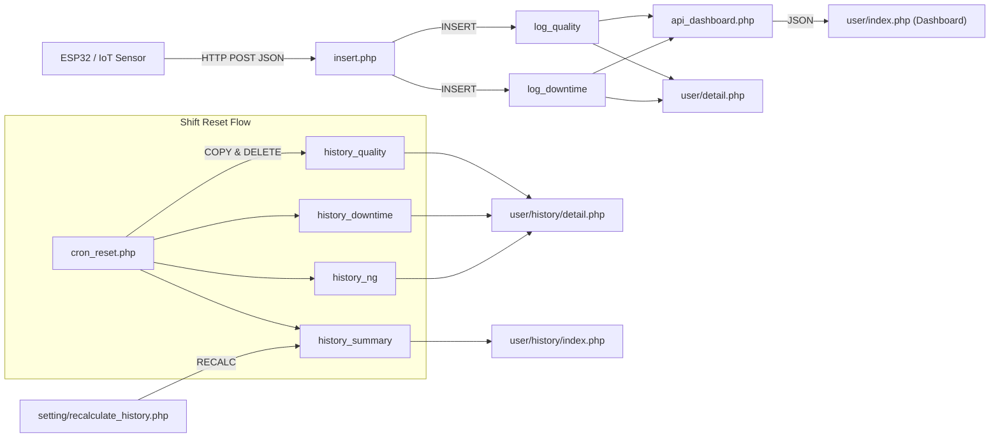
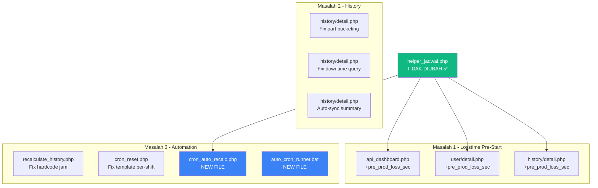

# PRD — Perbaikan Kritis Sistem IoT OEE Factory Dashboard

> **Dokumen ini adalah Product Requirements Document (PRD) lengkap** untuk model AI Worker (Gemini 3.8 Flash).  
> Dibuat: 18 September 2026, 09:19 WIB  
> Target: Menyelesaikan 3 masalah kritis tanpa merusak logic yang sudah berjalan.

---

## Daftar Isi

1. [Konteks Sistem](#1-konteks-sistem)
2. [Masalah 1: Losstime Tidak Terhitung Sebelum Mesin Menyala](#2-masalah-1-losstime-pre-machine-start)
3. [Masalah 2: History Detail Hanya Tampil Part Terakhir & Pareto 0](#3-masalah-2-history-detail--pareto)
4. [Masalah 3: Reset Manual & Shift 2 Acak-Acakan](#4-masalah-3-automasi-reset--shift-2)
5. [Peta Integrasi & Dependency Map](#5-peta-integrasi)
6. [Rencana Perubahan Per-File](#6-rencana-perubahan)
7. [Rencana Verifikasi](#7-rencana-verifikasi)
8. [Open Questions](#8-open-questions)

---

## 1. Konteks Sistem

### Arsitektur Data Flow



### Tabel Database Utama

| Tabel | Fungsi |
|---|---|
| `log_quality` | Data realtime dari ESP32 (prodCount, mcStatus, mcInfo, op_NIK) |
| `log_downtime` | Durasi downtime dihitung di `insert.php` saat status berubah |
| `log_ng` | Data NG/Repair input operator |
| `master_jam_statis` | Template slot jam kerja (rentang_jam, menit_efektif) per shift/hari |
| `master_line` | Mapping Line → Template Jadwal |
| `setting_pabrik` | jam_reset_shift1 & jam_reset_shift2 |
| `history_quality/ng/downtime` | Arsip setelah shift reset |
| `history_summary` | Rekap OEE per mesin per shift per tanggal |

### File Helper Utama (JANGAN UBAH KECUALI BENAR-BENAR PERLU)

| File | Fungsi Kunci |
|---|---|
| [helper_jadwal.php](file:///c:/xampp/htdocs/iot/helper_jadwal.php) | `getActiveShift()`, `calculateShiftPPTSeconds()`, `calculateStandardOEE()`, `clipIntervalToShift()`, `classifyDowntimeCategory()`, `getJadwalStatisSlots()` |
| [insert.php](file:///c:/xampp/htdocs/iot/insert.php) | Entry point data IoT, downtime tracking, gap detection |

> [!CAUTION]
> **`helper_jadwal.php` adalah SSOT (Single Source of Truth)**. Semua formula OEE (ISO 22400-2) ada di sini. Jangan duplikasi formula di file lain. Gunakan fungsi yang sudah ada.

---

## 2. Masalah 1: Losstime Pre-Machine Start

### Deskripsi Masalah

Operator datang pukul **07:00** (sesuai jadwal di `master_jam_statis`). Mereka melakukan **P5M/Meeting selama 20 menit** sebelum menyalakan mesin. Karena mesin belum nyala, **ESP32 belum mengirim data ke `insert.php`**, sehingga:

1. **Tidak ada record di `log_quality`** pada rentang 07:00–07:20
2. **Tidak ada perubahan status** → `insert.php` tidak men-trigger `log_downtime`
3. **Dashboard menunjukkan losstime = 0** padahal 20 menit sudah terpakai untuk P5M

### Root Cause Analysis

```
insert.php (line 56-101):
├── Downtime HANYA tercatat saat mcInfo BERUBAH dari satu status ke status lain
├── Jika mesin BELUM PERNAH mengirim data → tidak ada "perubahan status"
└── Hasil: Gap antara jam_mulai_jadwal dan data pertama masuk = INVISIBLE LOSSTIME
```

Di `api_dashboard.php` dan `user/detail.php`, downtime dihitung dari:
- **Historical**: `log_downtime` (sudah tersimpan) → di-clip ke shift window
- **Ongoing**: Status saat ini bukan "Running" → hitung mundur ke perubahan terakhir

**Tidak ada mekanisme** yang menghitung gap antara `work_start` (07:00) dan timestamp data pertama masuk (07:20).

### Solusi: "Pre-Production Implicit Losstime"

> [!IMPORTANT]
> Tambahkan perhitungan **implicit losstime** = gap antara jadwal mulai kerja (`work_start` dari `getActiveShift()`) dan timestamp data pertama yang masuk ke `log_quality` untuk mesin tersebut dalam shift aktif.

#### Perubahan di [api_dashboard.php](file:///c:/xampp/htdocs/iot/api_dashboard.php)

**Lokasi**: Setelah block "2. Ambil Data Downtime Real-Time (Ongoing)" (sekitar line 203), **sebelum** line 205 (`// 3. Kalkulasi Standar ISO 22400-2`).

**Logic baru**:

```php
// 2.5 PRE-PRODUCTION IMPLICIT LOSSTIME
// Hitung gap antara jadwal mulai kerja dan data pertama masuk
$pre_prod_loss_sec = 0;
$work_start_ts = strtotime($shift_info['work_start'] ?? $waktu_mulai);

// Cari timestamp data pertama untuk mesin ini di shift aktif
$sql_first_data = "SELECT MIN(timestamp) as first_ts 
                   FROM log_quality 
                   WHERE $mc_where 
                   AND timestamp >= '$waktu_mulai' 
                   AND timestamp <= '$waktu_selesai'";
$res_first_data = $conn->query($sql_first_data);
$first_data_ts = null;
if ($res_first_data && $res_first_data->num_rows > 0) {
    $fd = $res_first_data->fetch_assoc();
    if (!empty($fd['first_ts'])) {
        $first_data_ts = strtotime($fd['first_ts']);
    }
}

if ($first_data_ts !== null && $first_data_ts > $work_start_ts) {
    // Ada gap antara jadwal mulai kerja dan data pertama masuk
    $pre_prod_loss_sec = $first_data_ts - $work_start_ts;
    // CAP maksimal 2 jam (7200 detik) - mencegah false positive saat mesin memang off
    if ($pre_prod_loss_sec > 7200) $pre_prod_loss_sec = 0;
}
```

Kemudian ubah line 206:
```php
// SEBELUM:
$total_loss_detik = $historical_real_dt + $ongoing_real_dt;

// SESUDAH:
$total_loss_detik = $historical_real_dt + $ongoing_real_dt + $pre_prod_loss_sec;
```

#### Perubahan di [user/detail.php](file:///c:/xampp/htdocs/iot/user/detail.php)

**Lokasi**: Setelah block ongoing downtime (sekitar line 534), **sebelum** line 536 (`// 3. Kalkulasi Total Losstime Real Murni`).

**Logic identik** dengan api_dashboard.php di atas, tapi menggunakan variabel `$mc_where` yang sudah ada:

```php
// 2.5 PRE-PRODUCTION IMPLICIT LOSSTIME (Sinkron dengan api_dashboard.php)
$pre_prod_loss_sec = 0;
$work_start_ts = strtotime($shift_info['work_start'] ?? $waktu_mulai);
$sql_first_data = "SELECT MIN(timestamp) as first_ts FROM log_quality WHERE $mc_where AND timestamp >= '$waktu_mulai' AND timestamp <= '$waktu_selesai'";
$res_first_data = $conn->query($sql_first_data);
if ($res_first_data && $res_first_data->num_rows > 0) {
    $fd = $res_first_data->fetch_assoc();
    if (!empty($fd['first_ts'])) {
        $fts = strtotime($fd['first_ts']);
        if ($fts > $work_start_ts) {
            $pre_prod_loss_sec = $fts - $work_start_ts;
            if ($pre_prod_loss_sec > 7200) $pre_prod_loss_sec = 0;
        }
    }
}
```

Kemudian ubah line 537:
```php
// SEBELUM:
$total_real_dt = $historical_real_dt + $ongoing_downtime_sec;

// SESUDAH:
$total_real_dt = $historical_real_dt + $ongoing_downtime_sec + $pre_prod_loss_sec;
```

Dan tambahkan ke `$pareto_map` agar muncul di Pareto chart:
```php
if ($pre_prod_loss_sec > 0) {
    $pareto_map['P5M / Pre-Production'] = ($pareto_map['P5M / Pre-Production'] ?? 0) + $pre_prod_loss_sec;
    $tpm_summary_map['Pemeliharaan / 5S'] = ($tpm_summary_map['Pemeliharaan / 5S'] ?? 0) + $pre_prod_loss_sec;
}
```

#### Perubahan di [user/history/detail.php](file:///c:/xampp/htdocs/iot/user/history/detail.php)

**Lokasi**: Setelah block downtime historis (line 585-591), **sebelum** OEE calculation (line 593).

**Logic serupa** tapi sumber data dari `history_quality`:

```php
// PRE-PRODUCTION IMPLICIT LOSSTIME (History Mode)
$pre_prod_loss_sec = 0;
if ($shift_aktif != 'REKAP HARIAN' && $shift_aktif != 'ALL') {
    $work_start_ts_h = $shift_start_ts; // Sudah di-set dari line 560
    $sql_first_hist = "SELECT MIN(timestamp) as first_ts FROM history_quality WHERE mcID IN ($in_mcID) AND $filter_waktu_hq";
    $res_first_hist = $conn->query($sql_first_hist);
    if ($res_first_hist && $res_first_hist->num_rows > 0) {
        $fd = $res_first_hist->fetch_assoc();
        if (!empty($fd['first_ts'])) {
            $fts = strtotime($fd['first_ts']);
            if ($fts > $work_start_ts_h) {
                $pre_prod_loss_sec = $fts - $work_start_ts_h;
                if ($pre_prod_loss_sec > 7200) $pre_prod_loss_sec = 0;
            }
        }
    }
}
$total_real_dt += $pre_prod_loss_sec;
$totalLosstimeMenit = round($total_real_dt / 60);

if ($pre_prod_loss_sec > 0) {
    $pareto_map['P5M / Pre-Production'] = ($pareto_map['P5M / Pre-Production'] ?? 0) + $pre_prod_loss_sec;
    $tpm_summary_map['Pemeliharaan / 5S'] = ($tpm_summary_map['Pemeliharaan / 5S'] ?? 0) + $pre_prod_loss_sec;
}
```

> [!WARNING]
> **Hubungan dengan `menit_efektif`**: Kolom `menit_efektif` di `master_jam_statis` sudah **otomatis diperhitungkan** oleh `calculateShiftPPTSeconds()`. Jika slot 07:00-08:00 punya `menit_efektif = 50`, PPT sudah otomatis 50 menit (bukan 60). Implicit losstime di atas **menambah loss, bukan mengurangi PPT** — ini sesuai ISO 22400-2 karena P5M adalah Planned Downtime.

---

## 3. Masalah 2: History Detail & Pareto

### Masalah 2A: Tabel Dekidaka Hanya Tampil Part Terakhir

#### Deskripsi

Di [history/detail.php](file:///c:/xampp/htdocs/iot/user/history/detail.php) line 80-88, query mengambil info part dari `history_quality` tapi hanya **1 record terakhir** (`ORDER BY hq.id DESC LIMIT 1`). Ini menjadi label utama halaman.

Namun **masalah sebenarnya** ada di **tabel Dekidaka** (line 260-386). Query `$sql_logs` sudah mengambil **SEMUA** log dalam shift window dan membuat bucketing per-part. **TAPI** screenshot menunjukkan hanya 1 baris → ini berarti semua log punya `kode_proses` yang sama.

#### Root Cause

Di `history/detail.php` line 260-264:
```php
$sql_logs = "SELECT hq.timestamp, hq.prodCount, hq.op_NIK, c.part_name, 
             c.part_number, c.proses_name, c.ct_pcs, c.ct_jam 
             FROM history_quality hq 
             LEFT JOIN master_ct c ON hq.kode_proses = c.kode 
             WHERE hq.mcID IN ($in_mcID) AND $filter_waktu_hq 
             ORDER BY hq.timestamp ASC, hq.id ASC";
```

**Problem**: `hq.kode_proses` bisa NULL atau kosong untuk banyak record. `LEFT JOIN master_ct c ON hq.kode_proses = c.kode` akan menghasilkan NULL part_name. Di line 370: `$pName = !empty($row['part_name']) ? $row['part_name'] : 'Unknown';` → semua jadi "Unknown" dan di-merge ke 1 bucket.

**Juga**: Di screenshot, semua 24 jam menunjukkan angka **226** yang identik → ini dari **fallback Dekidaka** (line 480-514) yang membagi `totalOK` rata ke semua slot karena `$tableData` kosong.

#### Solusi

**Langkah 1**: Perbaiki query agar menggunakan kode_proses terakhir yang valid jika current record kosong:

```php
// GANTI line 260-264 dengan:
$sql_logs = "SELECT hq.timestamp, hq.prodCount, hq.op_NIK, 
             COALESCE(c.part_name, c_last.part_name) as part_name,
             COALESCE(c.part_number, c_last.part_number) as part_number,
             COALESCE(c.proses_name, c_last.proses_name) as proses_name,
             COALESCE(c.ct_pcs, c_last.ct_pcs) as ct_pcs,
             COALESCE(c.ct_jam, c_last.ct_jam) as ct_jam
             FROM history_quality hq 
             LEFT JOIN master_ct c ON hq.kode_proses = c.kode 
             LEFT JOIN (
                 SELECT hq2.mcID, hq2.timestamp, mc2.part_name, mc2.part_number, 
                        mc2.proses_name, mc2.ct_pcs, mc2.ct_jam, mc2.kode
                 FROM history_quality hq2
                 INNER JOIN master_ct mc2 ON hq2.kode_proses = mc2.kode
                 WHERE hq2.mcID IN ($in_mcID) AND $filter_waktu_hq
                   AND hq2.kode_proses IS NOT NULL AND hq2.kode_proses != ''
             ) c_last ON c_last.mcID = hq.mcID 
                      AND c_last.timestamp <= hq.timestamp
             WHERE hq.mcID IN ($in_mcID) AND $filter_waktu_hq 
             ORDER BY hq.timestamp ASC, hq.id ASC";
```

> [!WARNING]
> **Query di atas bisa lambat** karena self-join tanpa index. Alternatif yang lebih aman:

**Alternatif (Recommended — PHP-side resolution)**:

Ubah di PHP saja, **bukan** di SQL. Pertahankan query asli, tapi track kode_proses terakhir:

Di line 268, tambahkan variabel:
```php
$last_known_part = ['part_name' => '', 'part_number' => '', 'proses_name' => '', 'ct_pcs' => 0, 'ct_jam' => 0];
```

Di loop (line 276), setelah `$row = $res_logs->fetch_assoc()`:
```php
// Track part terakhir yang valid
if (!empty($row['part_name'])) {
    $last_known_part = [
        'part_name' => $row['part_name'],
        'part_number' => $row['part_number'] ?? '-',
        'proses_name' => $row['proses_name'] ?? 'PROSES 1',
        'ct_pcs' => $row['ct_pcs'] ?? 0,
        'ct_jam' => $row['ct_jam'] ?? 0
    ];
}
```

Di line 369-373, ganti fallback:
```php
// SEBELUM:
$pn = !empty($row['part_number']) ? $row['part_number'] : '-'; 
$pName = !empty($row['part_name']) ? $row['part_name'] : 'Unknown'; 
$proses = !empty($row['proses_name']) ? $row['proses_name'] : 'Proses 1';
$ct = !empty($row['ct_pcs']) ? $row['ct_pcs'] : 0; 
$target = !empty($row['ct_jam']) ? round($row['ct_jam']) : 0; 

// SESUDAH:
$pn = !empty($row['part_number']) ? $row['part_number'] : (!empty($last_known_part['part_number']) ? $last_known_part['part_number'] : '-');
$pName = !empty($row['part_name']) ? $row['part_name'] : (!empty($last_known_part['part_name']) ? $last_known_part['part_name'] : 'Unknown');
$proses = !empty($row['proses_name']) ? $row['proses_name'] : (!empty($last_known_part['proses_name']) ? $last_known_part['proses_name'] : 'PROSES 1');
$ct = !empty($row['ct_pcs']) ? $row['ct_pcs'] : (!empty($last_known_part['ct_pcs']) ? $last_known_part['ct_pcs'] : 0);
$target = !empty($row['ct_jam']) ? round($row['ct_jam']) : (!empty($last_known_part['ct_jam']) ? round($last_known_part['ct_jam']) : 0);
```

### Masalah 2B: Pareto Downtime = 0 di History Detail

#### Root Cause

Di [history/detail.php](file:///c:/xampp/htdocs/iot/user/history/detail.php) line 555-584, query downtime:

```php
$res_dt_all = $conn->query("SELECT hd.timestamp, hd.kode_dt, hd.durasi_detik, md.label_dt 
                            FROM history_downtime hd 
                            LEFT JOIN master_downtime md ON hd.kode_dt = md.kode_dt 
                            WHERE hd.mcID IN ($in_mcID) AND $filter_waktu_hd");
```

**Problem 1**: `$filter_waktu_hd` menggunakan alias `hd.timestamp` yang sudah benar. Tapi `$in_mcID` dibentuk dari `$arr_ids` (line 23-29) yang berisi gabungan mcID + id_mesin. **JIKA** `history_downtime` menyimpan `mcID` dengan format yang berbeda dari yang dicari (misal: history punya `3196` tapi URL pakai `2 WS35 - 020`), data tidak ketemu.

**Problem 2**: Saat `cron_reset.php` melakukan reset, di line 53:
```php
$conn->query("INSERT IGNORE INTO history_downtime (...) SELECT ... FROM log_downtime WHERE mcID='$mcID' ...");
```

`$mcID` di sini berasal dari `log_quality.mcID` yang bisa jadi string id_mesin ATAU numeric mcID. Inkonsistensi ini menyebabkan **history_downtime kosong untuk beberapa mesin**.

**Problem 3**: `$shift_start_ts` dan `$shift_end_ts` (line 560-561) dihitung dari `$waktu_mulai`/`$waktu_selesai` yang di-derive dari `history_summary`. Untuk **SHIFT 2**, jika `history_summary.waktu_mulai` tidak ter-record dengan benar, clipping bisa menghasilkan 0.

#### Solusi

**Di [history/detail.php](file:///c:/xampp/htdocs/iot/user/history/detail.php)**, ganti block line 555-584:

```php
// 1. Hitung Downtime Historis - STANDAR INTERNASIONAL ISO 22400-2 & TPM
$historical_real_dt = 0;
$pareto_map = [];
$tpm_summary_map = [];

// FIX: Query downtime dari KEDUA tabel (history + log) untuk memastikan tidak miss
$dt_queries = [
    "SELECT hd.timestamp, hd.kode_dt, hd.durasi_detik, md.label_dt 
     FROM history_downtime hd 
     LEFT JOIN master_downtime md ON hd.kode_dt = md.kode_dt 
     WHERE hd.mcID IN ($in_mcID) AND $filter_waktu_hd",
    "SELECT ld.timestamp, ld.kode_dt, ld.durasi_detik, md.label_dt 
     FROM log_downtime ld 
     LEFT JOIN master_downtime md ON ld.kode_dt = md.kode_dt 
     WHERE ld.mcID IN ($in_mcID) AND {$filter_waktu_hd}"
];

// Gunakan timestamp sebagai key unik untuk deduplikasi
$processed_dt = [];

$shift_start_ts = !empty($waktu_mulai) ? strtotime($waktu_mulai) : strtotime($tanggal . ' 00:00:00');
$shift_end_ts = !empty($waktu_selesai) ? strtotime($waktu_selesai) : strtotime($tanggal . ' 23:59:59');

// FIX SHIFT 2: Pastikan shift window benar untuk lintas malam
if ($shift_aktif == 'SHIFT 2' && $shift_end_ts <= $shift_start_ts) {
    $shift_end_ts = strtotime('+1 day', $shift_end_ts);
}

foreach ($dt_queries as $dt_sql) {
    // Ganti alias filter jika dari log_downtime
    $dt_sql_fixed = str_replace('hd.timestamp', 'ld.timestamp', $dt_sql);
    // Gunakan original alias untuk history_downtime
    if (strpos($dt_sql, 'history_downtime') !== false) {
        $dt_sql_fixed = $dt_sql;
    }
    
    $res_dt_all = $conn->query($dt_sql_fixed);
    if ($res_dt_all && $res_dt_all->num_rows > 0) {
        while ($dt_row = $res_dt_all->fetch_assoc()) {
            $dt_key = $dt_row['timestamp'] . '_' . $dt_row['kode_dt'] . '_' . $dt_row['durasi_detik'];
            if (isset($processed_dt[$dt_key])) continue; // Deduplikasi
            $processed_dt[$dt_key] = true;
            
            $dt_kode = strtoupper($dt_row['kode_dt']);
            $dt_label_master = $dt_row['label_dt'];
            $dt_dur = (int)$dt_row['durasi_detik'];
            
            $label = ($dt_kode == 'SB' || $dt_kode == 'STAND BY') ? 'Stand By' 
                   : ($dt_kode == 'MESIN OFF' ? 'Mesin Off' 
                   : ($dt_label_master ? $dt_label_master : $dt_row['kode_dt']));
            
            $end_ts = strtotime($dt_row['timestamp']);
            $start_ts = $end_ts - $dt_dur;
            
            $clipped_dur = clipIntervalToShift($start_ts, $end_ts, $shift_start_ts, $shift_end_ts);
            if ($clipped_dur > 0) {
                $historical_real_dt += $clipped_dur;
                $pareto_map[$label] = ($pareto_map[$label] ?? 0) + $clipped_dur;
                
                $catInfo = classifyDowntimeCategory($label);
                $catLabel = $catInfo['category_label'];
                $tpm_summary_map[$catLabel] = ($tpm_summary_map[$catLabel] ?? 0) + $clipped_dur;
            }
        }
    }
}
```

### Masalah 2C: APQ/OEE Tidak Sinkron antara History Index dan History Detail

#### Root Cause

- `history/index.php` membaca dari `history_summary` (pre-calculated saat `cron_reset.php`)
- `history/detail.php` **menghitung ulang secara dinamis** dari raw data `history_quality`
- Jika `cron_reset.php` menghitung PPT/loss berbeda dari `history/detail.php`, hasilnya beda

#### Solusi

Pastikan `history/detail.php` juga menyimpan ulang ke `history_summary` setelah kalkulasi agar konsisten:

**Setelah** kalkulasi OEE di line 610, tambahkan auto-sync:

```php
// AUTO-SYNC: Update history_summary dengan kalkulasi dinamis terbaru
if ($oeeVal > 0 && !empty($summary['id'])) {
    $sync_sql = "UPDATE history_summary SET 
                    oee = '$oeeVal', 
                    availability = '$availVal', 
                    performance = '$perfVal', 
                    quality = '$qualVal',
                    downtime = '$total_real_dt'
                 WHERE id = '{$summary['id']}'";
    $conn->query($sync_sql);
}
```

> [!NOTE]
> Ini akan membuat `history/index.php` menampilkan nilai yang sama dengan `history/detail.php` setelah detail dibuka setidaknya sekali.

---

## 4. Masalah 3: Automasi Reset & Shift 2

### Masalah 3A: Shift 2 Acak-Acakan Saat Rekalkulasi Pagi Hari

#### Root Cause

Di [recalculate_history.php](file:///c:/xampp/htdocs/iot/setting/recalculate_history.php) line 149-153:

```php
$shifts = [
    ['label' => 'SHIFT 1', 'start' => "$tgl 06:00:00", 'end' => "$tgl 16:00:00"],
    ['label' => 'SHIFT 2', 'start' => "$tgl 16:00:00", 'end' => date('Y-m-d 06:00:00', strtotime("$tgl +1 day"))]
];
```

**PROBLEM**: Jam shift di-hardcode `06:00` dan `16:00`, **TIDAK membaca dari `setting_pabrik`!**

Jika `setting_pabrik` punya `jam_reset_shift1 = 18:00` dan `jam_reset_shift2 = 07:00`, maka window shift yang digunakan recalculate **BERBEDA** dari yang digunakan `cron_reset.php` dan dashboard. Akibatnya:

- Data Shift 2 tanggal 17 September (18:00 → 07:00+1) di-query dengan window 16:00 → 06:00+1 = **1 jam shift window terbuang**
- Overlap data antar shift menyebabkan **double counting** atau **missing data**

#### Solusi: Baca jam reset dari `setting_pabrik`

**Ganti line 149-153**:

```php
// Baca jam reset dari setting_pabrik (BUKAN hardcode!)
$sql_sp_rc = $conn->query("SELECT jam_reset_shift1, jam_reset_shift2 FROM setting_pabrik LIMIT 1");
$sp_rc = ($sql_sp_rc && $sql_sp_rc->num_rows > 0) ? $sql_sp_rc->fetch_assoc() : [];
$rc_jam_s1 = $sp_rc['jam_reset_shift1'] ?? '16:00:00';
$rc_jam_s2 = $sp_rc['jam_reset_shift2'] ?? '06:00:00';

$shifts = [
    ['label' => 'SHIFT 1', 'start' => "$tgl $rc_jam_s2", 'end' => "$tgl $rc_jam_s1"],
    ['label' => 'SHIFT 2', 'start' => "$tgl $rc_jam_s1", 'end' => date("Y-m-d $rc_jam_s2", strtotime("$tgl +1 day"))]
];
```

### Masalah 3B: Automasi Penuh (Tanpa Reset Manual)

#### Situasi Saat Ini

- `cron_reset.php` **sudah support auto-reset** dengan logic "Sapu Ranjau" (line 332-337)
- Tapi trigger condition (line 343): harus `is_past_schedule && is_idle` (15 menit idle setelah jadwal pulang)
- **Problem**: Jika cron scheduler (Task Scheduler) tidak berjalan tepat waktu, data menumpuk

#### Solusi: Dual-Layer Automation

**Layer 1 — Cron Job yang Lebih Sering** (sudah ada, perlu diperkuat):

Buat file [auto_cron_runner.bat](file:///c:/xampp/htdocs/iot/auto_cron_runner.bat):

```bat
@echo off
REM Auto Cron Runner - Jalankan setiap 5 menit via Task Scheduler
php "C:\xampp\htdocs\iot\cron_reset.php" >> "C:\xampp\htdocs\iot\logs\cron_%date:~-4,4%%date:~-7,2%%date:~-10,2%.log" 2>&1
```

Pada Task Scheduler: Set trigger **setiap 5 menit** (bukan 1x sehari).
`cron_reset.php` sudah aman dipanggil berulang — hanya mesin yang memenuhi syarat reset yang akan di-proses.

**Layer 2 — Auto-Recalculate pada API Dashboard** (NEW):

Tambahkan di [api_dashboard.php](file:///c:/xampp/htdocs/iot/api_dashboard.php) sebuah check: jika ada data `log_quality` yang sudah melewati shift sebelumnya dan belum ada di `history_summary`, jalankan mini-reset.

> [!IMPORTANT]
> **JANGAN implementasi Layer 2 di api_dashboard.php** karena akan membuat API lambat. Sebagai gantinya, buat endpoint terpisah.

**Buat file baru**: [cron_auto_recalc.php](file:///c:/xampp/htdocs/iot/cron_auto_recalc.php)

```php
<?php
/**
 * AUTO-RECALCULATE HISTORY
 * Dipanggil bersamaan dengan cron_reset.php setiap 5 menit.
 * Tugasnya: Cek history_summary yang sudah ada tapi OEE = 0, lalu recalculate.
 * Ini menangani kasus dimana cron_reset berhasil memindahkan data tapi 
 * kalkulasi OEE gagal/tidak akurat.
 */
set_time_limit(300);
ini_set('memory_limit', '512M');
date_default_timezone_set('Asia/Jakarta');

$host = "localhost"; $user = "root"; $pass = ""; $db = "simulasi";
$conn = new mysqli($host, $user, $pass, $db);
if ($conn->connect_error) die("Koneksi Gagal: " . $conn->connect_error);
$conn->query("SET time_zone = '+07:00'");
require_once __DIR__ . '/helper_jadwal.php';

echo "Auto-Recalc Started: " . date('Y-m-d H:i:s') . "\n";

// Ambil jam reset
$sql_sp = $conn->query("SELECT jam_reset_shift1, jam_reset_shift2 FROM setting_pabrik LIMIT 1");
$sp = ($sql_sp && $sql_sp->num_rows > 0) ? $sql_sp->fetch_assoc() : [];
$jam_s1 = $sp['jam_reset_shift1'] ?? '16:00:00';
$jam_s2 = $sp['jam_reset_shift2'] ?? '06:00:00';

// Cari history_summary 7 hari terakhir dengan OEE = 0 tapi total_ok > 0
$res_broken = $conn->query("
    SELECT hs.id, hs.tanggal, hs.shift, hs.mcID, hs.total_ok, hs.total_ng,
           hs.waktu_mulai, hs.waktu_selesai, hs.oee
    FROM history_summary hs
    WHERE hs.tanggal >= DATE_SUB(CURDATE(), INTERVAL 7 DAY)
      AND hs.total_ok > 0
      AND (hs.oee <= 0 OR hs.oee IS NULL OR hs.availability <= 0 OR hs.downtime IS NULL)
    ORDER BY hs.tanggal DESC, hs.shift ASC
    LIMIT 50
");

if (!$res_broken || $res_broken->num_rows == 0) {
    echo "Tidak ada data yang perlu di-recalculate.\n";
    exit;
}

$count = 0;
while ($row = $res_broken->fetch_assoc()) {
    $tgl = $row['tanggal'];
    $shift = $row['shift'];
    $mcID = $row['mcID'];
    
    // Tentukan window waktu
    if ($shift == 'SHIFT 1') {
        $s_start = "$tgl $jam_s2";
        $s_end = "$tgl $jam_s1";
    } else {
        $s_start = "$tgl $jam_s1";
        $s_end = date("Y-m-d $jam_s2", strtotime("$tgl +1 day"));
    }
    
    // Ambil info CT dan line
    $info = $conn->query("SELECT m.nama_mesin, c.part_name, c.ct_pcs, c.line 
                          FROM history_quality q 
                          LEFT JOIN master_mesin m ON (q.mcID = m.id_mesin OR q.mcID = m.mcID) 
                          LEFT JOIN master_ct c ON q.kode_proses = c.kode 
                          WHERE q.mcID = '$mcID' AND q.timestamp >= '$s_start' AND q.timestamp <= '$s_end' 
                          ORDER BY q.id DESC LIMIT 1");
    
    if (!$info || $info->num_rows == 0) continue;
    $i = $info->fetch_assoc();
    $ct_pcs = (float)($i['ct_pcs'] ?? 0);
    $line = $i['line'] ?? '';
    
    // Hitung PPT
    $template = getLineTemplate($conn, $line);
    $hari = getLogicalDay(strtotime($s_start));
    $ppt_sec = calculateShiftPPTSeconds($conn, $template, $shift, $hari, $s_start, strtotime($s_end));
    if ($ppt_sec <= 0) $ppt_sec = 480 * 60;
    
    // Hitung Downtime
    $dt_res = $conn->query("SELECT kode_dt, durasi_detik, timestamp FROM history_downtime WHERE mcID = '$mcID' AND timestamp >= '$s_start' AND timestamp <= '$s_end'");
    $total_dt = 0;
    if ($dt_res && $dt_res->num_rows > 0) {
        $ss_ts = strtotime($s_start);
        $se_ts = strtotime($s_end);
        while ($dr = $dt_res->fetch_assoc()) {
            $e = strtotime($dr['timestamp']);
            $s = $e - (int)$dr['durasi_detik'];
            $total_dt += clipIntervalToShift($s, $e, $ss_ts, $se_ts);
        }
    }
    
    // Hitung OEE
    $total_ok = (int)$row['total_ok'];
    $total_ng = (int)$row['total_ng'];
    $std = calculateStandardOEE($ppt_sec, $total_dt, $total_ok, $total_ng, $ct_pcs);
    
    if ($std['oee'] > 0) {
        $conn->query("UPDATE history_summary SET 
            oee = '{$std['oee']}', 
            availability = '{$std['availability']}', 
            performance = '{$std['performance']}', 
            quality = '{$std['quality']}',
            downtime = '$total_dt'
            WHERE id = '{$row['id']}'");
        echo "  [FIXED] $tgl $shift $mcID: OEE {$row['oee']}% -> {$std['oee']}%\n";
        $count++;
    }
}

echo "Auto-Recalc Done. Fixed: $count records.\n";
```

Update [auto_cron_runner.bat](file:///c:/xampp/htdocs/iot/auto_cron_runner.bat):
```bat
@echo off
REM Auto Cron Runner - Jalankan setiap 5 menit via Task Scheduler
php "C:\xampp\htdocs\iot\cron_reset.php" >> "C:\xampp\htdocs\iot\logs\cron_%date:~-4,4%%date:~-7,2%%date:~-10,2%.log" 2>&1
php "C:\xampp\htdocs\iot\cron_auto_recalc.php" >> "C:\xampp\htdocs\iot\logs\recalc_%date:~-4,4%%date:~-7,2%%date:~-10,2%.log" 2>&1
```

### Masalah 3C: Fix `cron_reset.php` untuk Shift 2 yang Lintas Malam

Di [cron_reset.php](file:///c:/xampp/htdocs/iot/cron_reset.php) line 190-191, pencarian template hanya menggunakan `nama_template` (single column). Tapi `master_line` sekarang punya `nama_template_shift1` dan `nama_template_shift2`.

**Perbaiki line 189-191**:
```php
// SEBELUM:
if (!empty($line_m)) {
    $res_tpl = $conn->query("SELECT nama_template FROM master_line WHERE nama_line = '$line_m' LIMIT 1");
    if ($res_tpl && $res_tpl->num_rows > 0) $template_aktif = $res_tpl->fetch_assoc()['nama_template'];
}

// SESUDAH:
if (!empty($line_m)) {
    $line_m_esc = $conn->real_escape_string($line_m);
    $res_tpl = $conn->query("SELECT nama_template, nama_template_shift1, nama_template_shift2 FROM master_line WHERE nama_line = '$line_m_esc' LIMIT 1");
    if ($res_tpl && $res_tpl->num_rows > 0) {
        $tpl_row = $res_tpl->fetch_assoc();
        if ($shift_label == 'SHIFT 1' && !empty($tpl_row['nama_template_shift1'])) {
            $template_aktif = $tpl_row['nama_template_shift1'];
        } elseif ($shift_label == 'SHIFT 2' && !empty($tpl_row['nama_template_shift2'])) {
            $template_aktif = $tpl_row['nama_template_shift2'];
        } else {
            $template_aktif = $tpl_row['nama_template'] ?? 'DEFAULT';
        }
    }
}
```

---

## 5. Peta Integrasi



> [!IMPORTANT]
> **`helper_jadwal.php` TIDAK DIMODIFIKASI**. Semua perubahan menggunakan fungsi yang sudah ada di sana. Ini menjamin zero regression pada formula OEE.

---

## 6. Rencana Perubahan Per-File

### File yang Dimodifikasi

| # | File | Perubahan | Masalah |
|---|---|---|---|
| 1 | [api_dashboard.php](file:///c:/xampp/htdocs/iot/api_dashboard.php) | +20 baris: Pre-production implicit losstime | M1 |
| 2 | [user/detail.php](file:///c:/xampp/htdocs/iot/user/detail.php) | +25 baris: Pre-production implicit losstime + pareto entry | M1 |
| 3 | [user/history/detail.php](file:///c:/xampp/htdocs/iot/user/history/detail.php) | +80 baris: Fix part tracking, fix downtime dual-source, pre-prod loss, auto-sync | M1, M2A, M2B, M2C |
| 4 | [setting/recalculate_history.php](file:///c:/xampp/htdocs/iot/setting/recalculate_history.php) | ~5 baris: Baca jam dari `setting_pabrik` | M3A |
| 5 | [cron_reset.php](file:///c:/xampp/htdocs/iot/cron_reset.php) | ~10 baris: Fix template per-shift dari `master_line` | M3C |

### File Baru

| # | File | Fungsi |
|---|---|---|
| 6 | [cron_auto_recalc.php](file:///c:/xampp/htdocs/iot/cron_auto_recalc.php) | Auto-fix history_summary yang broken (OEE=0) |
| 7 | [auto_cron_runner.bat](file:///c:/xampp/htdocs/iot/auto_cron_runner.bat) | Batch file untuk Task Scheduler |

### File yang TIDAK Diubah (Konfirmasi Safety)

| File | Alasan |
|---|---|
| `helper_jadwal.php` | SSOT — semua formula sudah benar |
| `insert.php` | Entry point IoT — stabil, tidak perlu diubah |
| `helper_downtime.php` | Classifier TPM — sudah lengkap |
| `user/history/index.php` | Hanya baca `history_summary` — akan sinkron otomatis via M2C |
| `pengaturan_jam.php` | UI setting — tidak ada logic kalkulasi |
| `pengaturan_jam_detail.php` | UI setting — tidak ada logic kalkulasi |
| `pengaturan_line.php` | UI setting — sudah support dual template |

---

## 7. Rencana Verifikasi

### Test Case Manual

| # | Skenario | Expected Result |
|---|---|---|
| T1 | Buka `user/detail.php` untuk mesin yang sedang P5M (belum running) | Losstime > 0, muncul "P5M / Pre-Production" di Pareto |
| T2 | Buka `user/history/detail.php` untuk tanggal kemarin | Tabel Dekidaka menampilkan SEMUA part yang dikerjakan, bukan hanya terakhir |
| T3 | Cek Pareto chart di `history/detail.php` | Menampilkan bar downtime (bukan 0) |
| T4 | Bandingkan OEE di `history/index.php` card vs `history/detail.php` | Harus SAMA setelah detail dibuka |
| T5 | Jalankan `recalculate_history.php` untuk tanggal 17 Sept Shift 2 | Shift window menggunakan jam dari `setting_pabrik`, bukan hardcode |
| T6 | Jalankan `cron_auto_recalc.php` | History dengan OEE=0 tapi total_ok>0 otomatis di-fix |

### Automated Verification

```bash
# Test cron_reset.php (dry run)
php c:\xampp\htdocs\iot\cron_reset.php

# Test auto-recalc
php c:\xampp\htdocs\iot\cron_auto_recalc.php

# Verify history_summary setelah recalc
mysql -u root simulasi -e "SELECT tanggal, shift, mcID, total_ok, oee, availability FROM history_summary WHERE tanggal >= '2026-09-17' ORDER BY tanggal DESC, shift ASC LIMIT 20"
```

---

## 8. Open Questions

> [!IMPORTANT]
> **Q1**: Apakah kolom `downtime` sudah ada di tabel `history_summary`? Jika belum, perlu `ALTER TABLE`:
> ```sql
> ALTER TABLE history_summary ADD COLUMN downtime INT DEFAULT 0 COMMENT 'Total downtime dalam detik';
> ```

> [!IMPORTANT]
> **Q2**: Batas waktu P5M/Pre-Production cap saat ini di-set **2 jam (7200 detik)**. Apakah ini sesuai? Jika P5M biasanya hanya 20-30 menit, cap bisa diturunkan ke 3600 (1 jam) untuk mencegah false positive.

> [!IMPORTANT]
> **Q3**: Untuk **automasi penuh** via Task Scheduler setiap 5 menit — apakah server RDP/lokal punya hak akses membuat Scheduled Task? Atau lebih prefer menggunakan **`setInterval` PHP** dari web?

> [!IMPORTANT]
> **Q4**: Apakah user ingin **notifikasi Telegram** ketika cron_auto_recalc memperbaiki data? (Sudah ada skill untuk update Telegram di SKILL.md)

---

## Urutan Eksekusi (Untuk Worker Agent)

```
1. [MODIFY] setting/recalculate_history.php — Fix hardcode jam (5 menit)
2. [MODIFY] cron_reset.php — Fix template per-shift (5 menit)  
3. [MODIFY] user/history/detail.php — Fix part tracking + downtime + pre-prod (20 menit)
4. [MODIFY] user/detail.php — Add pre-prod losstime (5 menit)
5. [MODIFY] api_dashboard.php — Add pre-prod losstime (5 menit)
6. [NEW] cron_auto_recalc.php — Auto-fix broken history (10 menit)
7. [NEW] auto_cron_runner.bat — Scheduler batch file (2 menit)
8. [TEST] Jalankan recalculate untuk 17 Sept dan verifikasi
9. [TEST] Buka history/detail.php dan verifikasi Pareto + Dekidaka
10. [TEST] Buka user/detail.php dan verifikasi pre-prod losstime
```
